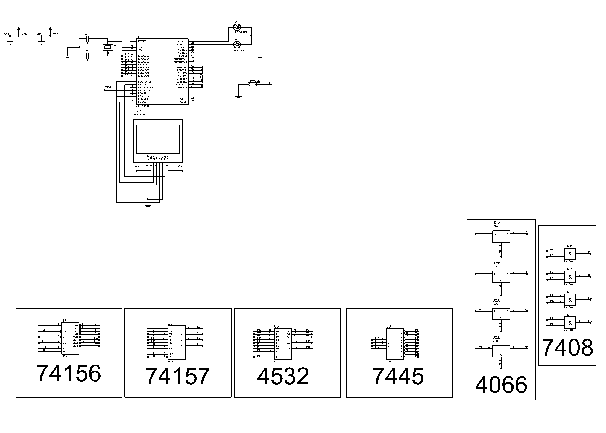
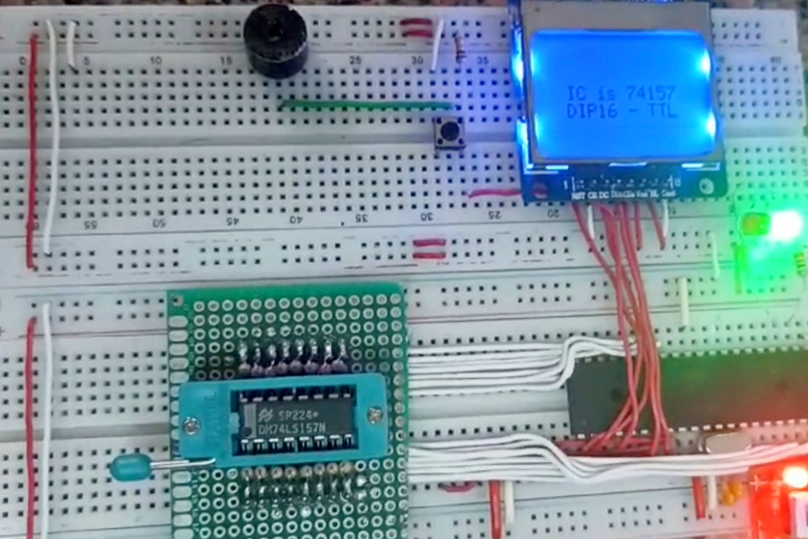

# TTL-CMOS_IC_Tester
An IC Tester for CMOS and TTL IC families built on the ATMEGA32 MCU. The firmware is written in C and uses the CodeVisionAVR Toolchain

## Hardware Overview

### Components Used:
1. **Microcontroller:** ATMEGA32A.
2. **Power Supply:** Any 5V DC Source.
3. **GLCD Display:** Nokia 5110 GLCD.
4. **ZIF Socket:** Only DIP14 and DIP16 are supported currently.
5. **Push Buttons & LEDs:** For interaction and feedback.
6. **Resistors & Capacitors:** Supporting components for things like Pull-ups and biasing the MCU crystal.

### Schematics:
Below is the schematic diagram for the IC Tester hardware. 

## Demo Images

### Hardware Setup
  
*Hardware showcasing DIP IC socket, GLCD, and microcontroller connections.*

### Testing in Action
  
*The IC Tester in action, validating a 74157 IC.*
